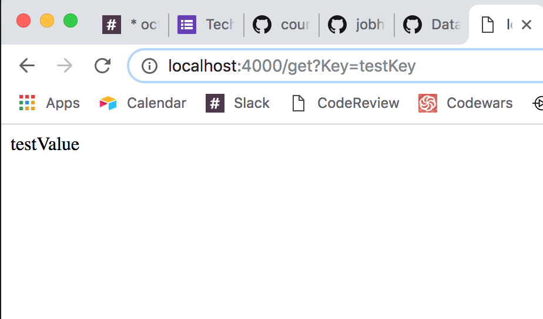

# Database server tech test
This a practice tech test involving the setup of a server in accordance with the instructions set out below.

I completed this tech-test in javascript, using cypress for feature testing and mocha/chai for unit testing. I also used ESlint for formatting and Istanbul for coverage. I chose cypress and mocha/chai based on their reputations for being clean, easy-to-use testing frameworks. I chose ESlint for similar reasons.

To use these tests and the linter, enter the following commands in terminal:
* To run cypress:
  * node app.js
  * (in a new window of terminal) node_modules/.bin/cypress open
* To run mocha: `./node_modules/mocha/bin/mocha`
* To run ESlint: `./node_modules/.bin/eslint app.js`
* To run istanbul: `cover node_modules/.bin/_mocha`

In terms of the structure of my code, I used app.js to manage all of the server's routing responsibilities. data.js is responsible for saving and outputting data based on the params it receives.

### Example

## Instructions

Today we will practice a tech test to demonstrate your understanding of web technologies. This is an actual tech test that was given to one of our coaches when they applied for a dev role.

Bear in mind that most tech tests do not have a set timeframe. Although we do have a "soft" time limit, imposed mainly by the structure of the week, we are not expecting you to finish within the day - so take your time and focus on writing the best code you can produce.

## The brief

You receive a message from a prospective employer:

"Before your interview, write a program that runs a server that is accessible on `http://localhost:4000/`. When your server receives a request on `http://localhost:4000/set?somekey=somevalue` it should store the passed key and value in memory. When it receives a request on `http://localhost:4000/get?key=somekey` it should return the value stored at `somekey`. Store the data in memory, not in a database, but bear in mind that you will later need to add a database to this code."

Create a new git repository and write code to fulfill the brief to the best of your ability. We will be looking for clean, well tested code in your choice of technology. In addition, the last sentence of the brief implies that you should consider how the code could easily be extended to add an as-yet-unknown data store.

If you still have time at the end of the day, you can extend the code by adding a data store of your choice.

